<div id="top"></div>

<!-- PROJECT LOGO -->
<br />
<div align="center">

<h3 align="center">Coffee Shop App</h3>

  <p align="center">
    Coffee Shop App with ReactJS
    <br/>
    
  </p>

<!-- TABLE OF CONTENTS -->
<details>
  <summary>Information</summary>
  <ol>
    <li>
      <a href="#about-the-project">About The Project</a>
      <ul>
        <li><a href="#built-with">Built With</a></li>
      </ul>
    </li>
    <li><a href="#demo">Demo</a></li>
    <li>
      <a href="#getting-started">Getting Started</a>
      <ul>
        <li><a href="#installation">Installation</a></li>
      </ul>
    </li>
    <li><a href="#screenshot">Screenshot</a></li>
    <li><a href="#contact">Contact</a></li>
  </ol>
</details>


<!-- ABOUT THE PROJECT -->
## About The Project


Coffee Shop is a POS (Point of sale) web application created using the ReactJS library, with the addition of reactstrap for responsive display, and react-router-dom for page switching management and also for data management on the frontend using redux. This website has 2 versions for User and Admin.


<p align="right">(<a href="#top">back to top</a>)</p>


### Built With

* [React.js](https://reactjs.org/)
* [Reactstrap](https://reactstrap.github.io/)
* [Redux](https://redux.js.org/)
* [Axios](https://www.npmjs.com/package/axios)
* [Vercel](https://vercel.com/)
* [Heroku](https://www.heroku.com/)
* [backend](https://github.com/farizian/week/19)
* [Demo](https://coffeeshop-swart.vercel.app)

<p align="right">(<a href="#top">back to top</a>)</p>

<!-- GETTING STARTED -->
<div id="demo"></div>

## Demo
This is a link to the demo [Coffee Shop](https://coffeeshop-swart.vercel.app)
- Login as user
  ```
  email: nobara1@gmail.com
  pass: 123
  ```
- Login as admin
  ```
  email: nobara2@gmail.com
  pass: 123
  ```

<!-- GETTING STARTED -->
<div id="getting-started"></div>

## Getting Started

### Prerequisites
* npm
  ```sh
  npm install npm@latest -g
  ```

### Installation

1. [Clone API](https://github.com/farizian/week/19)
2. Clone the repo
   ```sh
   git clone https://github.com/farizian/week/20
   ```
3. Install NPM packages
   ```sh
   npm install
   ```
4. Create your API in file `.env`
   ```.env
   REACT_APP_API_URL= 'YOUR API URL'
   ```

<p align="right">(<a href="#top">back to top</a>)</p>


<!-- ROADMAP -->
## Screenshot


>User Version

Web Landing page | Mobile Landing page
----------------------|---------------------
| 


Web Register page | Mobile Register page
----------------------|--------------------
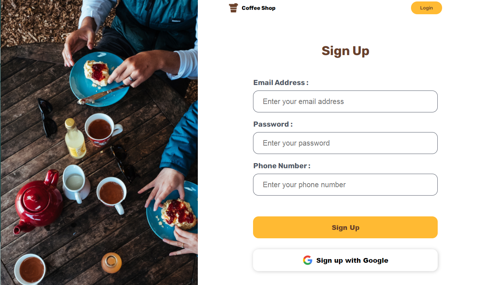 | 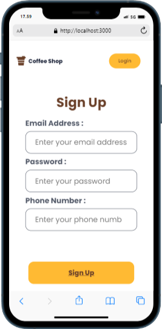

Web Login page | Mobile Login page
----------------------|--------------------
|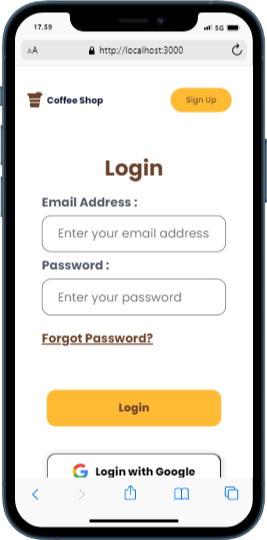


Web Products page | Mobile Products page
-------------------|----------------------
|


Web Details Products page | Mobile Details Products page
-------------------------|-----------------------
|


Web MyCart page | Mobile MyCart page
--------------------|----------------------
|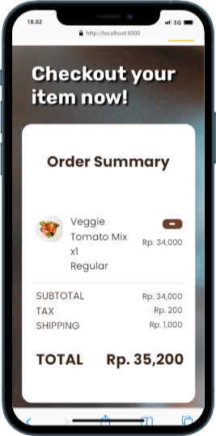


Web History page | Mobile History page
-------------------------|--------------------
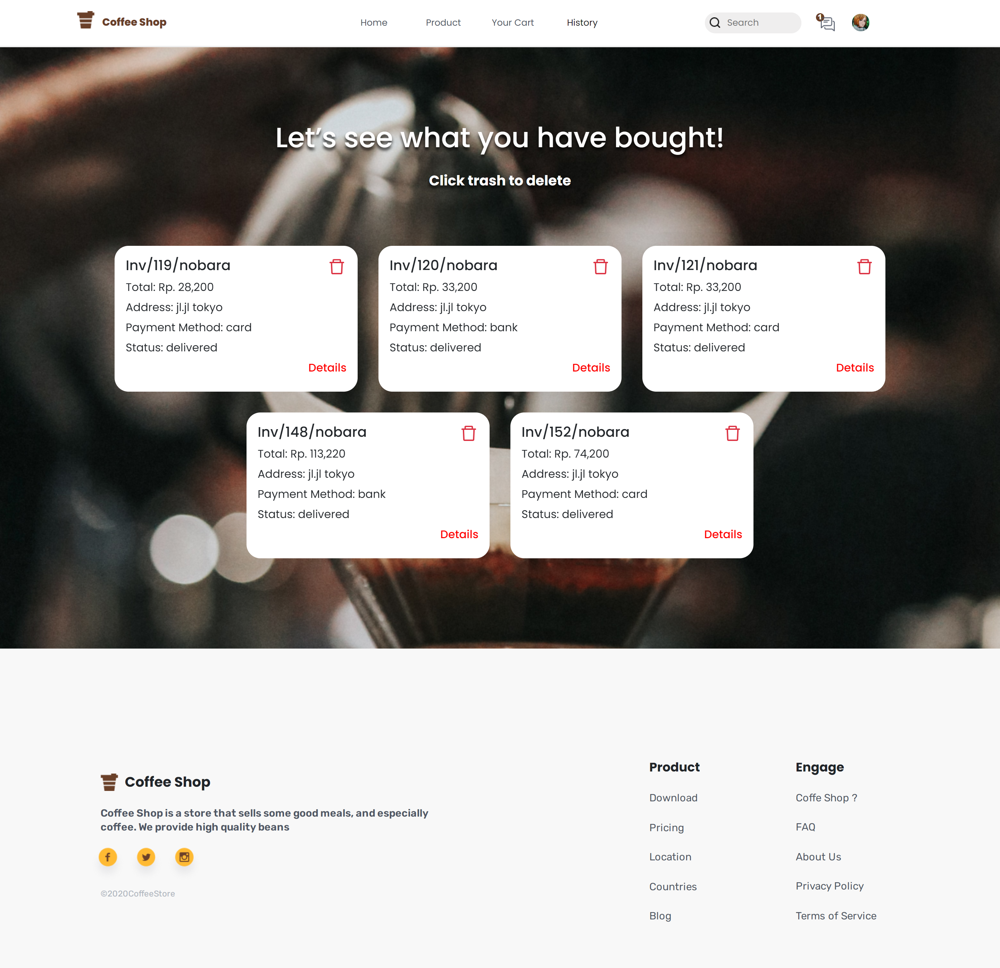|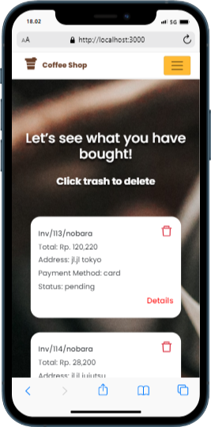


Web Detail History page | Mobile Detail History page
-------------------------|--------------------
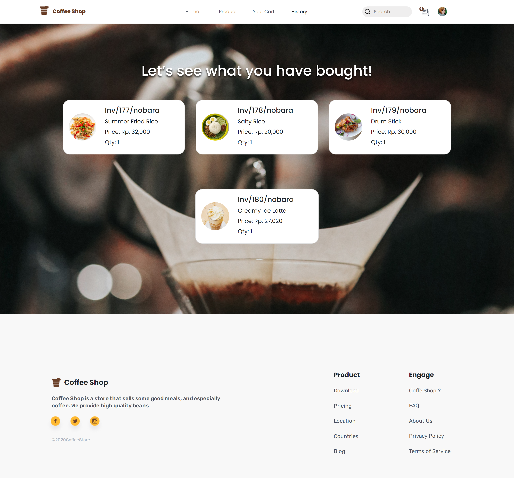|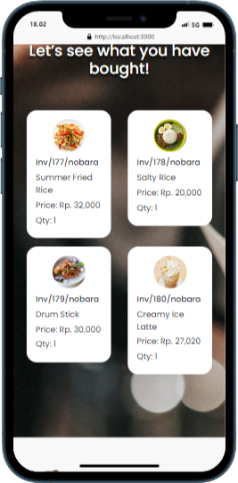


Website Profile page | Mobile Profile page
-------------------|--------------------
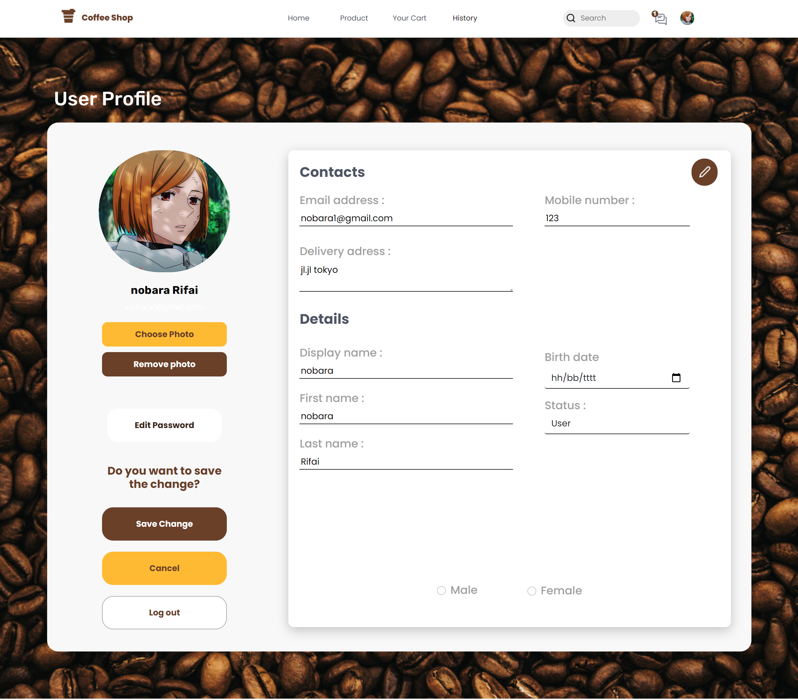|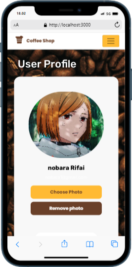


>Admin Version

Add product and Delete web version | Add product and Delete mobile version
---------------------|--------------------
|


Web Update Product page | Mobile Update Product page
---------------------|--------------------
|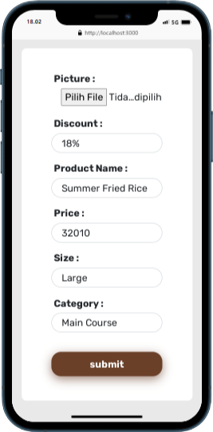

<p align="right">(<a href="#top">back to top</a>)</p>


<!-- CONTACT -->
## Contact

Fariz Irfan Rifai  - [@instagram](https://www.instagram.com/farizirfan008/) - farizirfan8@gmail.com

<p align="right">(<a href="#top">back to top</a>)</p>
